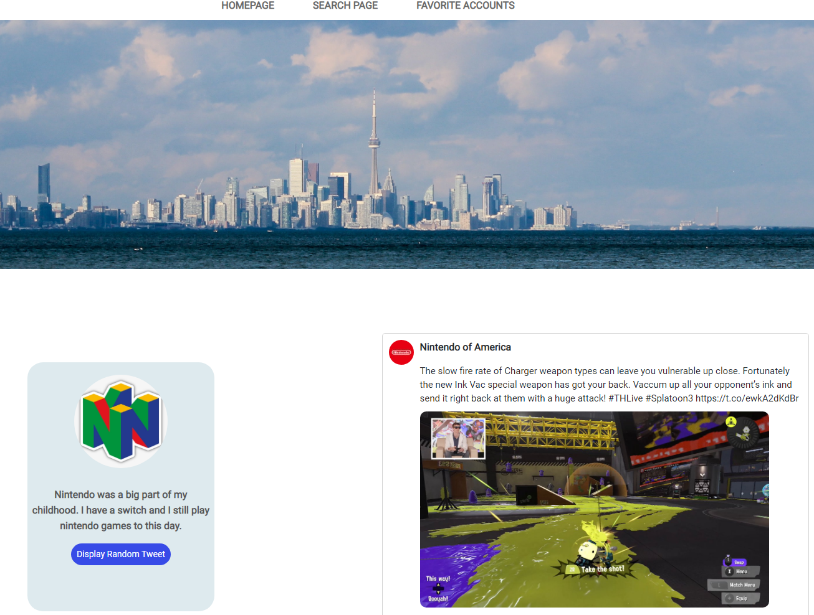

# Twitter Showcase App

A full stack application using React and Flask that interacts with the Twitter API to search for your favorite tweets!

Access it [here](https://twitter-showcase-app-rd.herokuapp.com/)

## Summary

This is my Twitter Showcase App. It works with the Twitter API in order to provide two main functions that displayed on separate pages. The Searcg Page allows you to search for tweets with keywords or users. On the Favorite Accounts page you will see my top five Twitter accounts and you can press a button to randomly display a few of their tweets. The process of creating this application was super fun and although it seemed a little daunting at the start, breaking the project down into smaller parts made it more manageable. This was the first time that I got to work with two different frameworks in one project. Combining React and Flask was tricky but having done it once, it will be definitely be easier going forward.

It's pretty cool how much I've learned since starting this project. Looking back now, I see that I've made some big jumps in terms of my front and back end development knowledge. To touch on a couple of things, I learned about custom CSS properties, conditional rendering in React, HTTP requests with Axios, connecting Front and back end frameworks and much more. I know that if you're looking for tweets you can just go on Twitter but I think this project is great because it not only shows what I can do as a programmer but also shares a little bit about who I am as a person.

## Installation Instructions

1. Run 'npm i --prefix twitter_flask_app/twitter-react-app' in the terminal (from the root directory)
2. Install 'poetry' command line tool for Python (https://python-poetry.org/docs/#installation)
3. Run 'poetry init' in the terminal (from the 'twitter_flask_app' directory)
4. Run 'poetry shell' in the terminal (from the 'twitter_flask_app' directory)
5. Run 'poetry install' in the terminal (from the 'twitter_flask_app' directory)
6. Create a file called '.env' and add the following properties: 'FLASK_APP=app.py', 'FLASK_DEBUG-true', 'TOKEN=XXX'
7. Run 'poetry run flask run' in the terminal (from the 'twitter_flask_app' directory)
8. In a separate terminal run 'npm run start --prefix twitter_flask_app/twitter-react-app' (from the root directory)

## Author

Raymond Dang - Full-Stack Software Developer - [Website](raymondquocdang.com) | [LinkedIn](https://www.linkedin.com/in/raymond-quoc-dang/)
